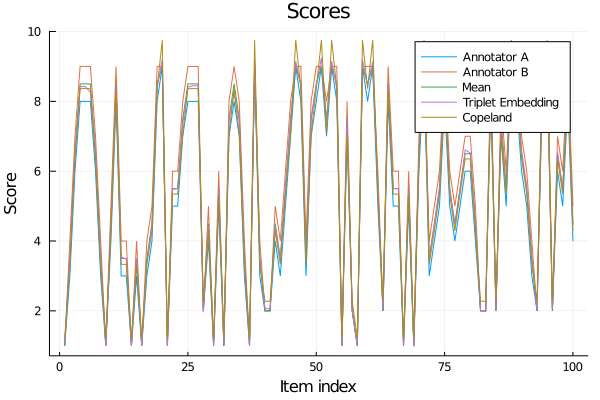

# AnnotationFusion
This package implements algorithms based on Copeland's method and Triplet Embeddings for fusion of human annotations. It supports both annotations in time (i.e. regression) as well as session-level annotations (i.e. classification, or unique annotations for a given item).

# Installation
To install Julia, please follow this [link](https://julialang.org/downloads/). The package has been tested in Julia v1.3 or newer.

In MacOS, the downloads are also distributed through Homebrew. To install Julia, you can simply do:
```bash
$ brew install julia # will install the latest stable version
```

To install the latest version, use Julia 1.2 or greater. In a Julia REPL, do:
```julia
julia> ]
(@v1.6) pkg> add https://github.com/usc-sail/AnnotationFusion.jl # Install annotation fusion package
```

# Usage
### Multithreadings
The underlying `TripletEmbeddings.jl` package uses multithreading. To start Julia with multiple threads, do:
```bash
$ julia --threads 4
```
or set the following environment variable (in your terminal, before starting Julia):
```bash
$ export JULIA_NUM_THREADS=4
```
More details can be found in the [documentation](https://docs.julialang.org/en/v1/manual/multi-threading/).

## Usage Examples
Several usage examples may be found in the `examples/` folder.

## Package
This package may also be used directly in Julia scripts. Please visit the `examples/` folder for examples.

### Classification (session-level annotations)
We assume that the annotations are saved in a CSV file, where each row represents a session and each column contains annotations from different annotators, plus an index column (in this case, `items`):

```julia
│ Row  │ items   │ A       │ B       │ C       │ D       │
│      │ Int64   │ Int64   │ Int64   │ Int64   │ Int64   │
├──────┼─────────┼─────────┼─────────┼─────────┼─────────┼
│ 1    │ 1       │ 6       │ 9       │ 6       │ missing │
│ 2    │ 2       │ 7       │ 9       │ 7       │ 7       │
│ 3    │ 3       │ 7       │ 9       │ 7       │ 7       │
│ 4    │ 4       │ 4       │ 9       │ 7       │ missing │
│ 5    │ 5       │ 3       │ 3       │ 3       │ missing │
│ 6    │ 6       │ 5       │ 5       │ 3       │ missing │
│ 7    │ 7       │ 6       │ 5       │ 3       │ 6       │
│ 8    │ 8       │ 5       │ 4       │ 2       │ 4       │
│ 9    │ 9       │ 4       │ 5       │ 3       │ missing │
⋮
```
You can use the methods `fuse` (to obtain a vector of fused annotations) of `fuse!` to append a column with the name of the method. We include four methods:

 - Mean
 - Median
 - Copeland's method (see [1])
 - Triplet Embeddings (see [3])

#### Mean and Median
We simply use the mean and median over rows (skipping `missing` or `NaN` values) to compute the scores.

#### Triplet Embeddings
We compute the pairwise distances between columns (considering the `missing` values) and sample triplets over these (currently using majority voting over all annotators). The number of triplets mined depends on the number of items or sessions. By default, we sample 20 * n * log(n) triplets.

#### Copeland's method
Uses an adapted version of Copeland's method to obtain points for each item, based on intra-annotator score or rating comparisons.

#### Example
The following example used all aforementioned methods:

```julia
using Plots
using Random
using DataFrames
using AnnotationFusion

Random.seed!(4)

n = 100
scores = rand(1:9, n)

# We generate a random DataFrame of scores, where one annotator has the same trend than the other
# We include an index column.
annotations = DataFrame(items = 1:n, A = scores, B = round.(Int, clamp.(1.2 .* scores, 1, 9)))

# Compute the mean
μ = fuse(annotations, :items, Mean())

# Compute the triplet embedding
te = fuse(annotations, :items, TE())

# Compute the points through the adapted Copeland's method
copeland = fuse(annotations, :items, Copeland())

# Plot the results
plot(annotations.A, label="Annotator A")
plot!(annotations.B, label="Annotator B")
plot!(μ, label="Mean")
plot!(te, label="Triplet Embedding")
plot!(copeland, label="Copeland")
```
This code generates the following results:




### Regression (or real-time, or time-continuous annotations)
Fusion for regression problems works the same way as in the example above. Note, however, that usually time-alignment is needed before the fusion, which is currently not implemented.

# References
 [1] Mundnich K, Nasir M, Georgiou PG, Narayanan SS. [_Exploiting Intra-Annotator Rating Consistency Through Copeland's Method for Estimation of Ground Truth Labels in Couples' Therapy_](https://sail.usc.edu/publications/html/b2hd-mundnich2017exploiting.html). In INTERSPEECH 2017 (pp. 3167-3171).
 
 [2] Booth BM, Mundnich K, Narayanan S. [_Fusing annotations with majority vote triplet embeddings_](https://sail.usc.edu/publications/html/b2hd-Booth2018FusingAnnotationswithMajority.html). In Proceedings of the 2018 on Audio/Visual Emotion Challenge and Workshop 2018 Oct 15 (pp. 83-89).
 
 [3] Mundnich K, Booth BM, Girault B, Narayanan S. [_Generating labels for regression of subjective constructs using triplet embeddings_](https://sail.usc.edu/publications/html/b2hd-Mundnich2019Generatinglabelsforregression.html). Pattern Recognition Letters. 2019 Dec 1; 128:385-92.
